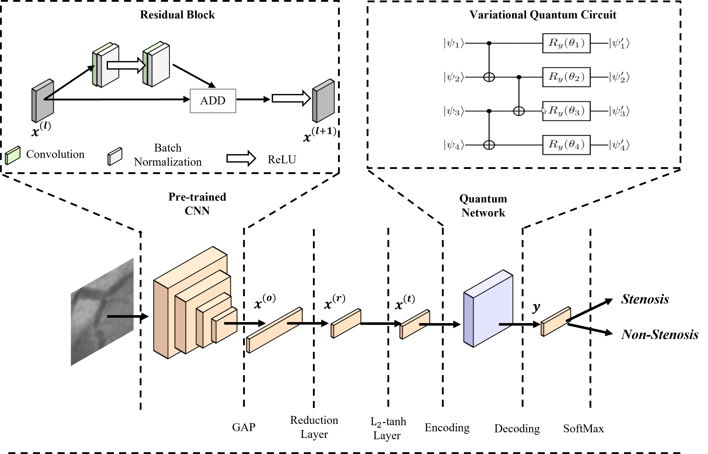

# Hybrid Classical-Quantum Convolutional Neural Network for Stenosis Detection in X-ray Coronary Angiography
----------

This repository hosts Python code for Hybrid Classical-Quantum Network (H-CQN). Our paper submitted to *Expert Systems With Applications* on 04 of July 2021. 
----------

##Dependencies

These are the dependencies to use H-CQN:

* matplotlib (>=3.3.4)
* numpy (>=1.19.5)
* pennylane (>=0.15.1)
* torch (>=1.8.1)
* torchvision (>=0.9.1)
* torchsummary (1.5.1)
* livelossplot (>=0.5.4)

##Quickstart

###Training 

###Testing

##Cite

